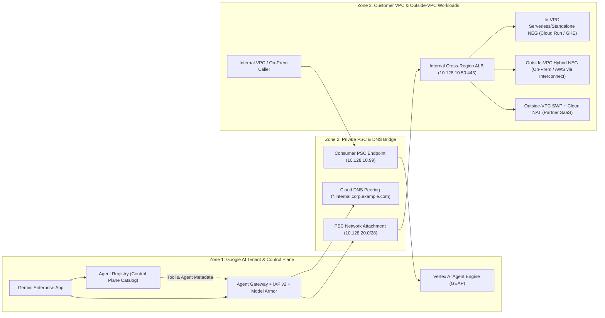

# Private Connectivity Reference Architecture & E2E Tests: Custom MCP (BYO-MCP) & A2A with PSC and VPC-SC

This repository implements and proves the end-to-end architecture for connecting **Gemini Enterprise App (`discoveryengine.googleapis.com`)** and **Vertex AI Agent Runtime (`aiplatform.googleapis.com`)** to private **Custom MCP (BYO-MCP)** servers and **Agent2Agent (A2A)** workloads over **Private Service Connect (PSC)** inside a **VPC Service Controls (VPC-SC)** perimeter.

* **Companion Google Doc Guide (with 5-Slide Executive Walkthrough):** [Private Connectivity Guide: Custom MCP (BYO-MCP) & A2A Agents with PSC and VPC-SC](https://docs.google.com/document/d/16bjMEo-vj8HLremQuTdE3l6hASpZ8qp-OO019x9SmrQ/edit)

---

## Architecture Summary: Control Plane vs. Data Plane



### Key Architectural Principles Proven by This Repository

1. **How Agent Registry Fits In (Control Plane vs. Data Plane):**
   * `Agent Registry` (`agentregistry.googleapis.com`) is the **control-plane catalog API** in your GCP project (`us-central1` or `europe-west1`).
   * Registering a writable `Service` (`gcloud agent-registry services create`) automatically populates the read-only `mcp-servers` and `agents` views.
   * `Agent Gateway` binds to `Agent Registry` (`registryBindings`) to verify approved destinations and evaluate **IAM v3 / IAP CEL rules** against tool annotations (`destination.agent_registry.mcp_server.tool.annotations.read_only_hint == true`) before forwarding traffic over PSC.
2. **Where You Register vs. Where MCP/A2A Workloads Run (Inside vs. Outside VPC):**
   * **Control Plane:** You **always** register in `Agent Registry` inside your VPC-SC-protected GCP project.
   * **Data Plane (`vpcEgress: ALL_TRAFFIC`):** Every outbound packet enters your Consumer VPC first via the **PSC Network Attachment** to your **Internal Cross-Region ALB (`10.128.10.50:443`)**, which routes to:
     * **In-VPC Workloads (Cloud Run, GKE, GCE):** via **Serverless NEG** or **Standalone NEG**.
     * **Outside-VPC On-Premises / Multi-Cloud Workloads:** via **Hybrid Connectivity NEG (`NON_GCP_PRIVATE_IP_PORT`)** over **Cloud Interconnect** or **HA VPN**.
     * **Outside-VPC Partner / SaaS Workloads:** via **Consumer PSC Endpoint** or **Secure Web Proxy (SWP) + Cloud NAT** (when allowlisted in `discoveryengine.managed.allowedEgressFqdns`).

---

## Repository Layout

* `manifests/` — Declarative GCP YAML/JSON configs (`connectivity-template.yaml`, `agent-gateway.yaml`, `iap-authz-extension.yaml`, `iap-authz-policy.yaml`, `iap-uap-policy.json`, `org-policies/*.yaml`, `specs/toolspec.json`, `specs/agent-card.json`).
* `scripts/deploy_gcp_infrastructure.sh` — Idempotent Steps 1–6 `gcloud` provisioning script (supports `DRY_RUN=true`).
* `scripts/publish_private_github_repo.sh` — One-command helper to create and push to a private GitHub repository via `gh repo create --private`.
* `src/mcp_a2a_psc_vpcsc/` — Runnable Python reference implementation of the Control Plane (`AgentRegistryStore`) and Data Plane (`RunningMCPServer`, `RunningA2AAgentServer`, `PSCNetworkAttachmentBridge`, `InternalCrossRegionALB`, `ConsumerPSCEndpoint`, `AgentGatewayProxy`, `VPCServiceControlsPerimeter`, `ModelArmorInspector`).
* `tests/` — Automated unit and live end-to-end integration tests (`pytest`).

---

## Running the End-to-End Tests

```bash
PYTHONPATH=src pytest -v
```

## Publishing to a Private GitHub Repository

```bash
./scripts/publish_private_github_repo.sh mcp-a2a-psc-vpcsc
```
