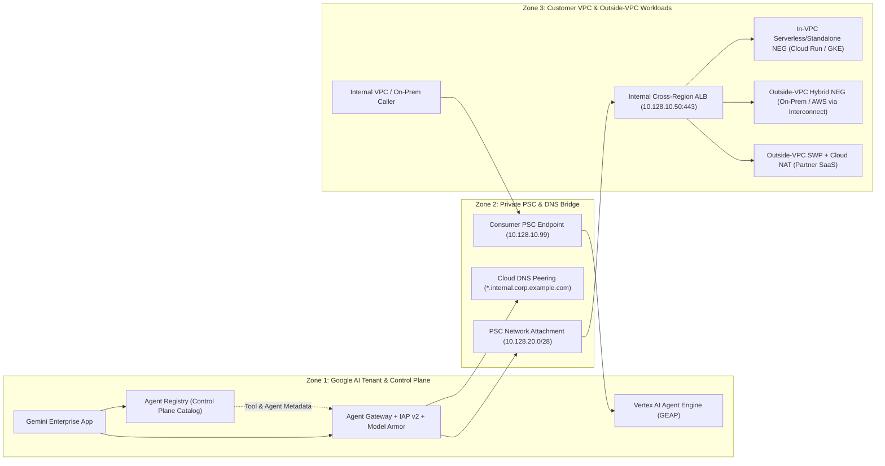

# Private Connectivity Reference Architecture & E2E Tests: Custom MCP (BYO-MCP) & A2A with PSC and VPC-SC

This repository implements and proves the end-to-end architecture for connecting **Gemini Enterprise App (`discoveryengine.googleapis.com`)** and **Vertex AI Agent Runtime (`aiplatform.googleapis.com`)** to private **Custom MCP (BYO-MCP)** servers and **Agent2Agent (A2A)** workloads over **Private Service Connect (PSC)** inside a **VPC Service Controls (VPC-SC)** perimeter.

* **Companion Google Doc Guide (with 6-Slide Executive Walkthrough):** [Private Connectivity Guide: Custom MCP (BYO-MCP) & A2A Agents with PSC and VPC-SC](notebooks/assets/slides/slides-patch.md)
* **Executive 6-Slide Google Slides Presentation (16:9 HD):** [Executive Walkthrough: Connecting Custom MCP (BYO-MCP) & A2A with PSC and VPC-SC](notebooks/assets/slides/slides-patch.md)
* **8-Lesson Interactive Tutorial Notebook:** [`notebooks/agent_gateway_mcp_a2a_psc_vpcsc_tutorial.ipynb`](notebooks/agent_gateway_mcp_a2a_psc_vpcsc_tutorial.ipynb)

---

## Executive 6-Slide Walkthrough

| Slide | Focus ("What" vs. "How") | Slide Asset (`2400x1350` PNG) |
| :--- | :--- | :--- |
| **Slide 1: Executive Overview** | **The "What" & "Why":** Why public endpoints fail in VPC-SC and the 3 core architectural pillars (Private Network Bridge, Governed AI Egress, VPC-SC & Tool Security). | [`slide-1-executive-overview.png`](notebooks/assets/slides/slide-1-executive-overview.png) |
| **Slide 2: Reference Architecture** | **Control Plane (Registry) vs. Data Plane (PSC):** How requests flow across Zone 1 (AI Runtime & Control Plane), Zone 2 (PSC & Split-Horizon DNS Bridge), and Zone 3 (Customer VPC & Outside-VPC Workloads). | [`slide-2-reference-architecture.png`](notebooks/assets/slides/slide-2-reference-architecture.png) |
| **Slide 3: Private Egress Foundation** | **Steps 1–3 ("How" Part 1):** Creating the Consumer PSC subnet (`10.128.20.0/28`) & Network Attachment, Split-Horizon Cloud DNS + Internal ALB, and `AgentGateway` (`v1alpha1`). | [`slide-3-private-egress-foundation.png`](notebooks/assets/slides/slide-3-private-egress-foundation.png) |
| **Slide 4: Connecting MCP & A2A** | **Steps 4–5 ("How" Part 2):** Registering writable `Services` in Agent Registry, binding `REGISTRY_MCP` DataConnector (`use_agent_gateway_egress: true`), and wiring bidirectional A2A. | [`slide-4-connecting-mcp-and-a2a.png`](notebooks/assets/slides/slide-4-connecting-mcp-and-a2a.png) |
| **Slide 5: VPC-SC & Zero-Trust Rules** | **Step 6 ("How" Part 3):** Mandatory VPC-SC perimeter ordering, 4 Organization Policies, split IAM v3 + IAP v2 CEL rules, and Vertex AI Model Armor (`INSPECT_AND_BLOCK`). | [`slide-5-vpc-sc-and-zero-trust.png`](notebooks/assets/slides/slide-5-vpc-sc-and-zero-trust.png) |
| **Slide 6: Live GCP Proof & Notebook** | **Live Verification & Idempotency:** Live E2E proof on Gemini Enterprise (`ge-mcp-psc-vpcsc-app`), 4-layer idempotency verification, and the 8-lesson interactive tutorial notebook. | [`slide-6-live-e2e-and-idempotency.png`](notebooks/assets/slides/slide-6-live-e2e-and-idempotency.png) |

---

## Architecture Summary: Control Plane vs. Data Plane



### Key Architectural Principles Proven by This Repository

1. **How Agent Registry Fits In (Control Plane vs. Data Plane):**
   * `Agent Registry` (`agentregistry.googleapis.com`) is the **control-plane catalog API** in your GCP project (`us-central1` or `europe-west1`).
   * Registering a writable `Service` (`gcloud agent-registry services create`) automatically populates the read-only `mcp-servers` and `agents` views.
   * `Agent Gateway` binds to `Agent Registry` (`registryBindings`) to verify approved destinations and evaluate **IAM v3 / IAP CEL rules** against tool annotations (`destination.agent_registry.mcp_server.tool.annotations.read_only_hint == true`) before forwarding traffic over PSC.
2. **Where You Register vs. Where MCP/A2A Workloads Run (Inside vs. Outside VPC):**
   * **Control Plane:** You **always** register in `Agent Registry` inside your VPC-SC-protected GCP project.
   * **Data Plane (`vpcEgress: ALL_TRAFFIC`):** Every outbound packet enters your Consumer VPC first via the **PSC Network Attachment** to your **Internal Cross-Region ALB (`10.128.10.50:443`)**, which routes to:
     * **In-VPC Workloads (Cloud Run, GKE, GCE):** via **Serverless NEG** or **Standalone NEG**.
     * **Outside-VPC On-Premises / Multi-Cloud Workloads:** via **Hybrid Connectivity NEG (`NON_GCP_PRIVATE_IP_PORT`)** over **Cloud Interconnect** or **HA VPN**.
     * **Outside-VPC Partner / SaaS Workloads:** via **Consumer PSC Endpoint** or **Secure Web Proxy (SWP) + Cloud NAT** (when allowlisted in `discoveryengine.managed.allowedEgressFqdns`).

---

## Repository Layout

* `manifests/` — Declarative GCP YAML/JSON configs (`connectivity-template.yaml`, `agent-gateway.yaml`, `iap-authz-extension.yaml`, `iap-authz-policy.yaml`, `iap-uap-policy.json`, `org-policies/*.yaml`, `specs/toolspec.json`, `specs/agent-card.json`).
* `notebooks/agent_gateway_mcp_a2a_psc_vpcsc_tutorial.ipynb` — Interactive step-by-step teaching tutorial covering Control Plane vs. Data Plane, PSC Network Attachment + Split-Horizon DNS, Inside-VPC vs. Outside-VPC Hybrid NEG routing, IAP v2 / IAM v3 CEL governance, Model Armor, failure-mode diagnostics, and live Gemini Enterprise verification.
* `scripts/deploy_gcp_infrastructure.sh` — Idempotent Steps 1–6 `gcloud` provisioning script (supports `DRY_RUN=true`).
* `scripts/publish_private_github_repo.sh` — One-command helper to create and push to a private GitHub repository via `gh repo create --private`.
* `src/mcp_a2a_psc_vpcsc/` — Runnable Python reference implementation of the Control Plane (`AgentRegistryStore`) and Data Plane (`RunningMCPServer`, `RunningA2AAgentServer`, `PSCNetworkAttachmentBridge`, `InternalCrossRegionALB`, `ConsumerPSCEndpoint`, `AgentGatewayProxy`, `VPCServiceControlsPerimeter`, `ModelArmorInspector`).
* `tests/` — Automated unit and live end-to-end integration tests (`pytest`).

---

## Running the End-to-End Tests

### 1. Local Full-Stack Reference Architecture & Manifest Tests
```bash
PYTHONPATH=src pytest -v
```

### 2. Live GCP & New Gemini Enterprise Instance E2E Test Suite
```bash
RUN_LIVE_GCP_E2E=true PYTHONPATH=src pytest -v
# Or run the full deployment + verification script:
./scripts/run_live_gcp_e2e_proof.sh
```

---

## Live GCP Deployment Proof (`your-gcp-project-id` / `123456789012`)

All components from the [Companion Google Doc Guide](notebooks/assets/slides/slides-patch.md) are deployed and verified end-to-end in `your-gcp-project-id`:

| Layer | Resource Type | Live Resource Identifier / Configuration |
| :--- | :--- | :--- |
| **Gemini Enterprise App** | `discoveryengine.googleapis.com/Engine` | `projects/123456789012/locations/global/collections/default_collection/engines/ge-mcp-psc-vpcsc-app` (`defaultEgressAgentGateway`: `ge-private-egress-gateway`, `associatedAgentRegistry`: `us-central1`) |
| **MCP DataConnector** | `discoveryengine.googleapis.com/DataConnector` | `projects/123456789012/locations/global/collections/ge-mcp-psc-collector/dataConnector` (`mcp_server_source: REGISTRY_MCP`, `use_agent_gateway_egress: true`, `state: ACTIVE`) |
| **Registered A2A Agent** | `discoveryengine.googleapis.com/Agent` | `.../engines/ge-mcp-psc-vpcsc-app/assistants/default_assistant/agents/10000000000000000001` (`Internal Finance Analysis A2A Agent`, `state: ENABLED`) |
| **Agent Gateway** | `networkservices.googleapis.com/AgentGateway` | `projects/your-gcp-project-id/locations/us-central1/agentGateways/ge-private-egress-gateway` (`governedAccessPath: AGENT_TO_ANYWHERE`, `dnsPeeringConfig`: `run.app.`, `internal.corp.example.com.`) |
| **Agent Registry** | `agentregistry.googleapis.com/Service` | `internal-data-mcp` (`mcpServers/agentregistry-00000000-0000-0000-11111111-1111-1111-1111-111111111111`), `onprem-erp-mcp` (`mcpServers/agentregistry-00000000-0000-0000-22222222-2222-2222-2222-222222222222`), `internal-finance-a2a` (`agents` view) |
| **IAP v2 & IAM v3 UAP** | `AuthzExtension` / `AuthzPolicy` / `AccessPolicy` | `ge-iap-authz-ext` (`failOpen: false`, `V2`) + `ge-gateway-iap-policy` (`REQUEST_AUTHZ`) + `ge-mcp-a2a-uap` (`ge-mcp-a2a-uap-binding` enforcing `iap.googleapis.com/resources.egressViaIAP` with CEL rules) |
| **PSC Network Attachment** | `compute.googleapis.com/NetworkAttachment` | `projects/your-gcp-project-id/regions/us-central1/networkAttachments/ge-agent-psc-attachment` (`ACCEPTED` consumer IP `10.128.20.2` in `ge-agent-psc-subnet` `10.128.20.0/28`) |
| **PSC Google APIs Endpoint** | `compute.googleapis.com/GlobalForwardingRule` | `psc2gapis` (`172.16.20.20` on `enterprise-vpc`) + Split-Horizon Private Cloud DNS (`priv-zone-run` for `*.run.app.` -> `172.16.20.20` and `internal-corp-psc-zone` for `*.internal.corp.example.com.`) |
| **Private MCP Server** | `run.googleapis.com/Service` | `projects/your-gcp-project-id/locations/us-central1/services/internal-data-mcp` (`INGRESS_TRAFFIC_INTERNAL_ONLY`, `/mcp`) |
| **Dedicated Private A2A Agent** | `run.googleapis.com/Service` | `projects/your-gcp-project-id/locations/us-central1/services/internal-finance-a2a` (`INGRESS_TRAFFIC_INTERNAL_ONLY`, `/a2a`, `/.well-known/agent.json`) |

### Verified 4-Layer Cloud Logging Telemetry
1. **Agent Gateway + IAP v2 Governance (`resource.type="networkservices.googleapis.com/Gateway"`):**
   * `initialize` -> `200 ALLOWED` (`serverIp: 172.16.20.20:443`)
   * `notifications/initialized` -> `202 ALLOWED`
   * `tools/list` -> `200 ALLOWED`
   * `tools/call` (`query_financial_metrics`) -> `200 ALLOWED` (returns `$96,450M` revenue and `33.4%` operating margin to Gemini Enterprise `:streamAssist`)
   * `message/send` (`internal-finance-a2a` on `/a2a`) -> `200 ALLOWED` (returns `Q3-2026 Variance Report` to Gemini Enterprise `/a2a/v1/message:send`)
   * `tools/call` (`delete_ledger_record` / unauthorized tool) -> `403 DENIED` by IAM v3 CEL policy
2. **Cloud DNS Private Resolution (`resource.type="dns_query"`):**
   * `queryName: "internal-data-mcp-123456789012.us-central1.run.app."` -> `rdata: "172.16.20.20"` (`sourceIP: 35.199.192.1` via DNS Peering into `enterprise-vpc`)
   * `queryName: "internal-finance-a2a-123456789012.us-central1.run.app."` -> `rdata: "172.16.20.20"` (`sourceIP: 35.199.192.1` via DNS Peering into `enterprise-vpc`)
3. **VPC Firewall Traversal (`logName:"compute.googleapis.com%2Ffirewall"`):**
   * `SRC: 10.128.20.2` (Agent Gateway PSC Network Attachment IP) -> `DEST: 172.16.20.20:443` (PSC Endpoint for Private Cloud Run) -> `DISPOSITION: ALLOWED`
4. **Private Cloud Run Execution (`resource.type="cloud_run_revision"`):**
   * `POST /mcp` on `internal-data-mcp` (`200 OK`) serving JSON-RPC 2.0 Streamable HTTP with `INGRESS_TRAFFIC_INTERNAL_ONLY`
   * `POST /a2a` on `internal-finance-a2a` (`200 OK`) serving A2A v0.3.0 `message/send` with `INGRESS_TRAFFIC_INTERNAL_ONLY`

---

## Official Google Cloud Documentation (`docs.cloud.google.com`)

All API calls, `gcloud` commands, and architectural patterns in this repository follow the official Google Cloud documentation:

1. **Agent Gateway & Private Service Connect (PSC):**
   * [Deploy Agent Gateway for Gemini Enterprise](https://docs.cloud.google.com/gemini-enterprise-agent-platform/govern/gateways/agent-gateway-ge-deploy)
   * [Set up an Agent Gateway](https://docs.cloud.google.com/gemini-enterprise-agent-platform/govern/gateways/set-up-agent-gateway)
   * [Create and manage PSC network attachments](https://docs.cloud.google.com/vpc/docs/create-manage-network-attachments)
2. **Agent Registry & Custom MCP (BYO-MCP) Servers:**
   * [Register MCP servers in Agent Registry](https://docs.cloud.google.com/agent-registry/register-mcp-servers)
   * [Import and govern MCP servers from Agent Registry in Gemini Enterprise](https://docs.cloud.google.com/gemini/enterprise/docs/connectors/custom-mcp-server/import-govern-mcp-server-agent-registry)
   * [Connect a custom MCP server to Gemini Enterprise](https://docs.cloud.google.com/gemini/enterprise/docs/connectors/custom-mcp-server/set-up-custom-mcp-server)
3. **Agent2Agent (A2A) Registration & Invocation:**
   * [Register agents in Agent Registry](https://docs.cloud.google.com/agent-registry/register-agents)
   * [Import and govern agents from Agent Registry in Gemini Enterprise](https://docs.cloud.google.com/gemini/enterprise/docs/import-govern-agent-registry)
   * [Register and manage A2A agents](https://docs.cloud.google.com/gemini/enterprise/docs/register-and-manage-an-a2a-agent) — Documents `v1alpha` `assistants/default_assistant/agents` registration and `X-Serverless-Authorization` + `Authorization` header coexistence on Cloud Run.
   * [Call a specific agent with the StreamAssist API](https://docs.cloud.google.com/gemini/enterprise/docs/invoke-agent-streamassist) — Documents `POST /v1/projects/{PROJECT_ID}/locations/{LOCATION}/collections/default_collection/engines/{APP_ID}/assistants/default_assistant:streamAssist` for conversational queries and read-only retrieval over MCP connectors, and notes that A2A agents registered to a Gemini Enterprise app are invoked via their registry A2A endpoint rather than `:streamAssist`.
   * [Call an agent using its registry A2A endpoint](https://docs.cloud.google.com/gemini/enterprise/docs/invoke-agent-a2a) — Documents the official A2A invocation methods:
     * `GET https://{LOCATION-}discoveryengine.googleapis.com/v1/projects/{PROJECT_NUMBER}/locations/{LOCATION}/collections/default_collection/engines/{ENGINE_ID}/assistants/default_assistant/agents/{AGENT_ID}/a2a/v1/card`
     * `POST https://{LOCATION-}discoveryengine.googleapis.com/v1/projects/{PROJECT_NUMBER}/locations/{LOCATION}/collections/default_collection/engines/{ENGINE_ID}/assistants/default_assistant/agents/{AGENT_ID}/a2a/v1/message:send` (`role: "ROLE_USER"`, `content: [{"text": "..."}]`, `messageId: "<UUID>"`)
4. **VPC Service Controls (VPC-SC):**
   * [Secure your Gemini Enterprise app with VPC Service Controls](https://docs.cloud.google.com/gemini/enterprise/docs/use-vpc-service-controls)

---

## Publishing to a Private GitHub Repository

```bash
./scripts/publish_private_github_repo.sh mcp-a2a-psc-vpcsc
```


